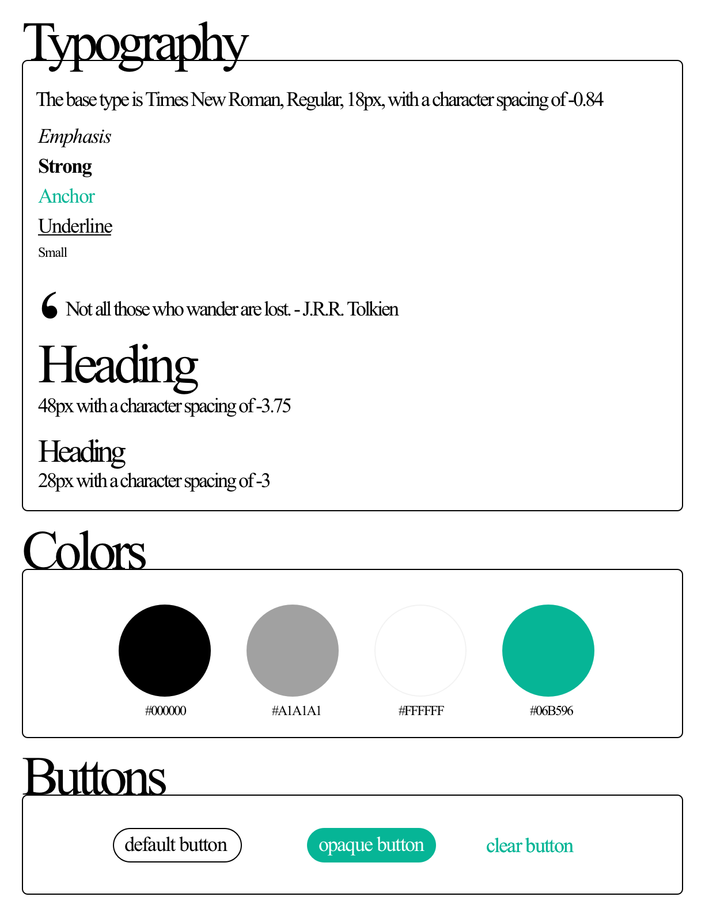

## Personal Blog Website

This project was built from scratch for the Front End Developer Nanodegree for Udacity, using HTML and CSS skills to build out a personal blog website.  The site includes custom images, layout, and styling with webpage design considerations.  A live preview of the blog can be viewed [here](https://fastalana.github.io/Personal-Blog-Website/).

### Style Guide

